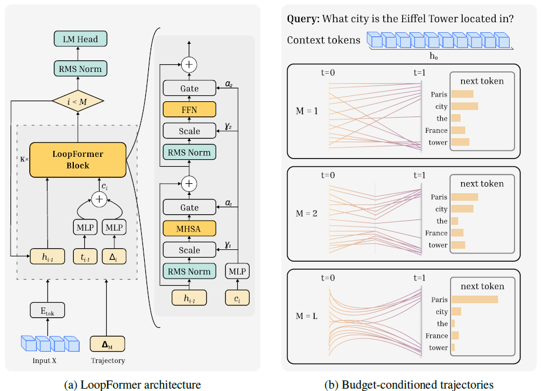

# LoopFormer: Elastic-Depth Looped Transformers for Latent Reasoning via Shortcut Modulation (ICLR 2026)

<a target="_blank" href="">
  
</a>
<a target="_blank" href="https://loopformer.github.io/">
  
</a>
<a target="_blank" href="https://huggingface.co/collections/armenjeddi/loopformer">
  
</a>

**Authors:**  
[Ahmadreza Jeddi](https://armenjeddi.github.io/), [Marco Ciccone](https://marcociccone.github.io/), [Babak Taati](https://www.cs.toronto.edu/~taati/)
<br>



---

This repository contains the official implementation of **LoopFormer**.

The codebase is a fork of **NanoGPT**, and we intentionally keep it as close as possible to the original implementation for clarity and reproducibility. Beyond the looped / elastic-depth components, the main architectural difference is using **RMSNorm** instead of **LayerNorm**.

---

## Installation

```bash
pip install torch numpy transformers datasets tiktoken wandb tqdm

